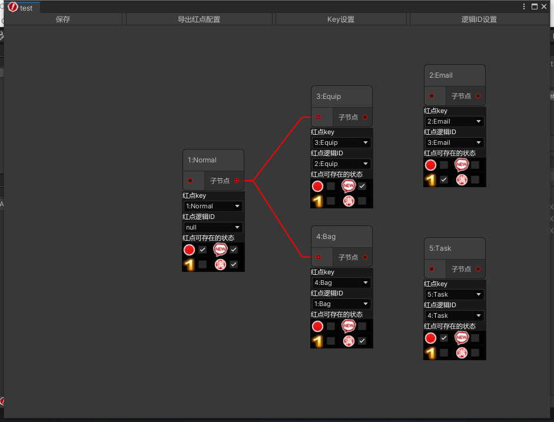
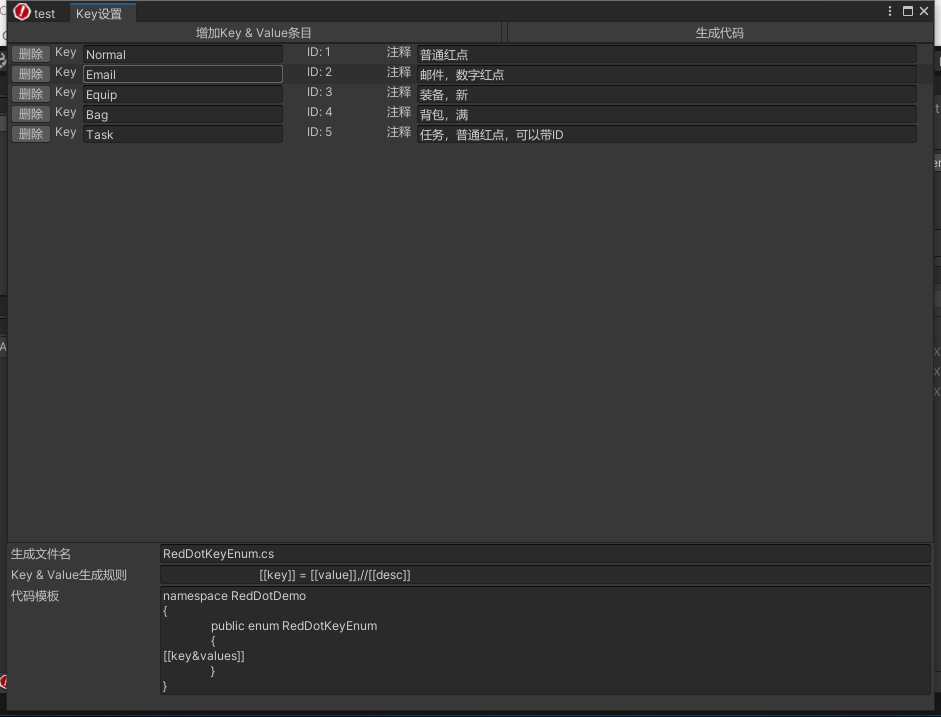
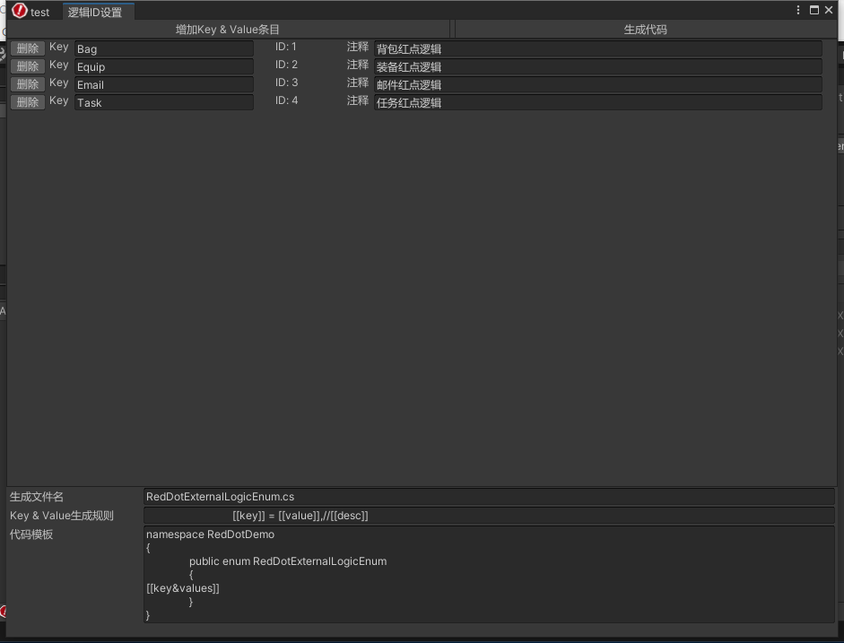
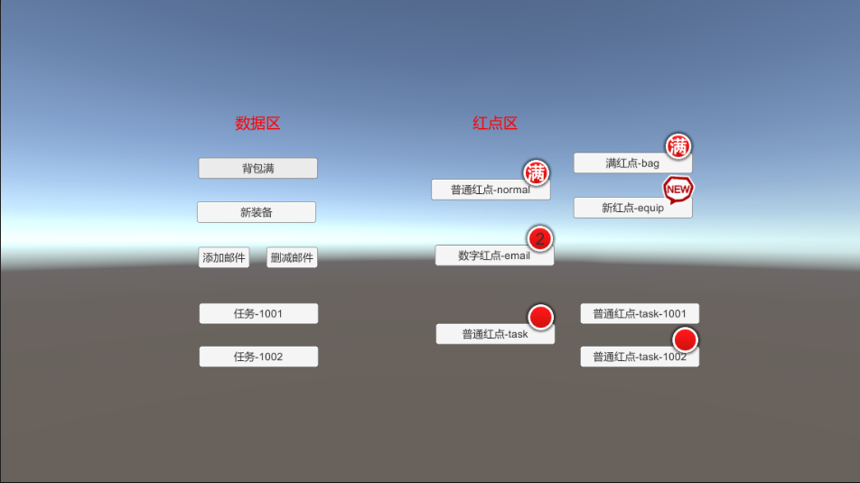

# RedDotGraph
基于unity UIElements实现的游戏红点工具及运行时代码。

在游戏客户端开发中，红点功能是必不可少的，难度不大，但红点之间的关系比较复杂，一般也不是那么直观，后续维护起来比较麻烦，有些时候还会多出一些逻辑代码的重复，比如ListView里的每个cell都要有红点。出于以上原因，搞了这个红点编辑器。

## 实现的功能

1. 红点及红点间的关系可视化
2. 红点key和红点逻辑ID只需编辑一次，无需在运行时代码中多次输入字符串或ID。根据模板代码生成所对应常量
3. cell的红点逻辑代码和非cell统一实现
4. 数据刷新采用非必要不刷新机制，数据没变化、没有绑定红点UI或者UI不可见时，都不会额外的触发刷新

红点编辑器相关界面展示







## 怎么使用

Demo：在Acenes下的TestRedDot.unity，运行效果



### 编辑器使用

#### 创建红点文件

Assets -> Create -> Red Dot Graph

给红点文件命名好，会出现一个红底白色叹号图标的文件，双击新建的文件打开红点编辑器window

在红点编辑器window里有一排按钮，分别是

​		保存：保存红点数据

​		导出红点配置：会导出一个给运行时用的json文件

​		key设置：红点节点key的管理，**一个key对应一个红点Node**

​		逻辑ID设置：红点逻辑ID的管理，**这里的ID对应运行时给红点注册的红点逻辑方法ID**

#### 管理红点key

红点编辑器window中点击“key设置”按钮，会打开一个key设置window，里面可以增加、删除、修改key及注释，同时设置key枚举代码模板也在此window中

#### 管理红点逻辑ID

红点编辑器window中点击“逻辑ID设置”按钮，会打开一个逻辑ID设置window，里面可以增加、删除、修改逻辑ID及注释，同时设置逻辑ID枚举代码模板也在此window中

#### 添加红点

在红点编辑器window中右键 -> Create Node -> RedDot Node，会在window中添加一个红点Node

#### 配置红点Node相关

红点Node里可以设置红点key（枚举了上面添加的红点key）、红点逻辑Id（枚举了上面添加的逻辑ID）

红点可存在的状态：多选，但运行时，状态只会显示最高级的状态，状态由低到高分别是：普通、数量、新、满

另，node里有一个子节点字样，这个是可以和其他node连接，可构成一个有向无环图

### 运行时使用

编辑器中通过“导出红点配置”按钮，会导出一个json文件，这个文件就是运行时的配置文件。

具体代码使用可以参考 TestRedDot.cs 类里的代码

```c#
//红点相关初始化
TestProxy.Ins().RegVisitors();//注入所有红点逻辑方法
RedDotManager.Ins().AddJsonFile("Assets/Resources/test.json");//加载红点图配置
//
TestProxy.Ins().InitData();//模拟正式数据初始化
//模拟切换面板，都是按照激活的面板来刷新红点，面板处于非激活状态下的红点UI是不刷新的
RedDotManager.Ins().AddFrame("TestPanel");//切换面板
```

注册红点逻辑方法，当需要重新刷新红点状态时，会调用所注册的方法，具体参考TestProxy.cs

```C#
RedDotExternalLogicVisitor.Ins().RegExternalLogic((int)RedDotExternalLogicEnum.Bag, RedDotFullBag);

RedDotExternalLogicVisitor.Ins().RegExternalLogic((int)RedDotExternalLogicEnum.Task, RedDotNormalTask_ID);//最好分开有ID和无ID的回调，如果不分开，需要对ID==0做判断
RedDotExternalLogicVisitor.Ins().RegExternalLogic((int)RedDotExternalLogicEnum.Task, RedDotNormalTask);
```


红点UI添加，参考RedDotUIMono.cs类

```C#
RedDotManager.Ins().AddUI(key, RedDotStatusUpdate, id);
```

获取红点状态，参考RedDotUIMono.cs类

```C#
RedDotManager.Ins().GetRedDotStatus(key, id, out status, out num);
```

红点状态、数据有变化，参考TestProxy.cs类

```C#
RedDotManager.Ins().DataChange(RedDotKeyEnum.Bag.ToString()); 
```


## 文档

各红点之间构成的是一个有向无环图，每个红点是一个节点

unity 版本：开发编辑器使用的版本是2020.2.2f1c1。应该支持UIElements的unity版本都能用

## License


